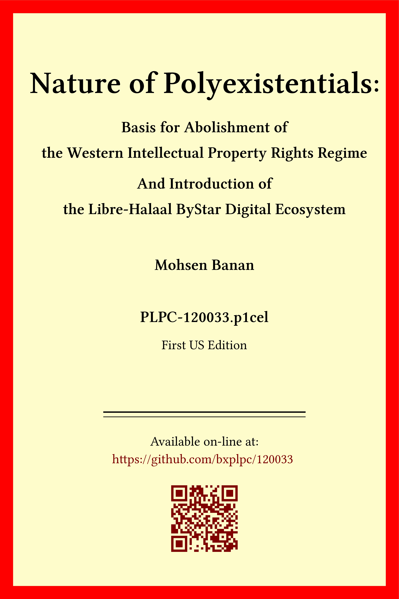

The Libre-Halaal ByStar Digital Ecosystem
=========================================

I am an engineer and researcher. Over the past two decades, I have been working
on creating a comprehensive, interdisciplinary, and ethics-oriented
non-proprietary digital ecosystem. We call it ByStar (By*). ByStar challenges
the existing proprietary American digital ecosystem while operating concurrently
alongside it. ByStar's primary offerings are tangible autonomy and genuine
privacy on a very large scale. ByStar represents a moral inversion of the
proprietary American internet services model. Recently, I authored a book
outlining an interdisciplinary blueprint for the realization of ByStar.

------------------------------------------------------------------------

<b>Nature of Polyexistentials:</b>

<b>Basis for Abolishment of the Western Intellectual Property Rights Regime</b>

<b>And Introduction of the Libre-Halaal ByStar Digital Ecosystem</b>

On Line: <a href="https://github.com/bxplpc/120033">PLPC-120033 at Github</a> --  <a href="https://doi.org/10.5281/zenodo.8003846">DOI </a>
 --- PDF: <a href="https://github.com/bxplpc/120033/blob/main/pdf/c-120033-1_04-book-8.5x11-col-emb-pub.pdf">8.5x11</a> --
 <a href="https://github.com/bxplpc/120033/blob/main/pdf/c-120033-1_04-book-a4-col-emb-pub.pdf">A4</a>

Order Book Prints At Amazon:<a href="https://www.amazon.com/dp/1960957015"> US </a> -- <a href="https://www.amazon.fr/dp/1960957015"> France </a>  -- <a href="https://www.amazon.co.uk/dp/1960957015"> UK </a> -- <a href="https://www.amazon.co.jp/dp/1960957015"> Japan </a>
(424 pages --- 6 x 0.96 x 9 inches)

Comments, Feedback:
<a href="mailto:plpc-120033@mohsen.1.banan.byname.net">plpc-120033@mohsen.1.banan.byname.net</a>

------------------------------------------------------------------------

Much of what you find on GitHub today represents the surrogate activities of
tunnel vision technocrats (sec 12.1.7). These engineers often produce or improve
component-oriented FOSS results which are usually tactical and limited in scope
and often end up catering to the interests of corporate American proprietary
internet service providers. ByStar, however, follows a different model. ByStar's
Git repositories are structured as public GitHub organizations that align with the
architecture of ByStar itself. All of these components primarily contribute to
our own digital ecosystem. Key engineering components of ByStar include: 
 
<b>BISOS: By* Internet Services Operating System</b> ---
On top of Debian, BISOS builds a unified and universal framework for developing
both internet services and software-service continuums that use internet
services. 
  
<b>Blee: BISOS Libre-Halaal Emacs
Environment</b> --- On top of Emacs and BISOS, Blee creates a
comprehensive integrated usage and development environment. Blee and BISOS are
fully integrated.
 
<b>BPO: BISOS Portable Objects</b> --- With
Git and similar to Apt, BPO establishes a platform for packaging of data,
software, and configurations of software. This creates a uniform model for
portability, encompassing services and personal information.
 
<b>PALS: Possession Assertable Libre Services</b> --- With
BPO and BISOS, PALS construct a model for optional self hosting of services.
In ByStar, individual-oriented services belong to the individual
and through PALS, autonomy and privacy is enforceable.
 
For bootstraping BISOS, Blee and ByStar; you can get started at: https://github.com/bxgenesis/start 

